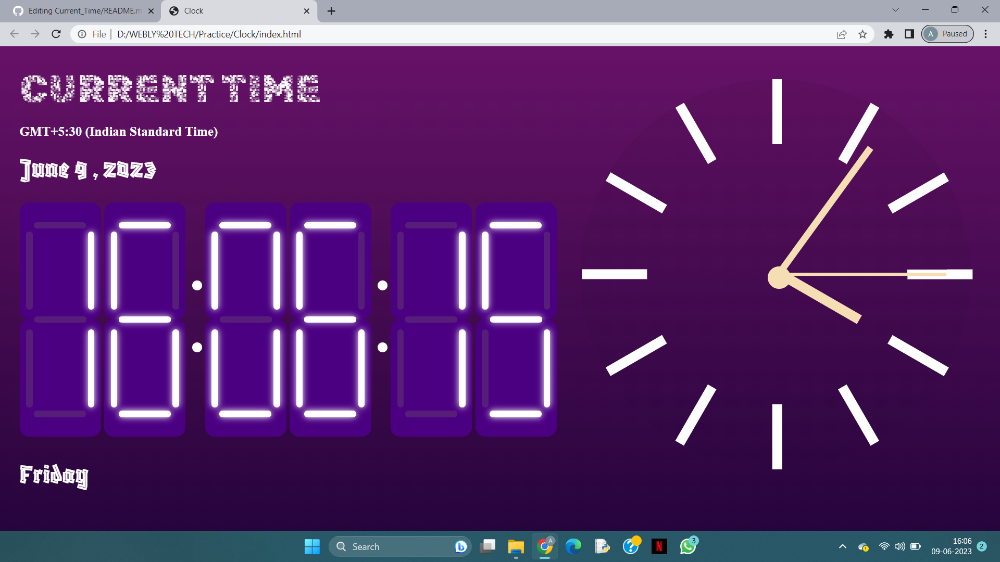

# Current_Time
* It shows the current date and time according to the system. 
* It represents the system time both in digital and analog mode.

# About the Webpage
The fonts used in this webpage are Google fonts (Blaka Hollow and Rubik Pixels). Loading of fonts may take few more seconds...

Here is a screenshot of the webpage showing the time both in analog and digital:

